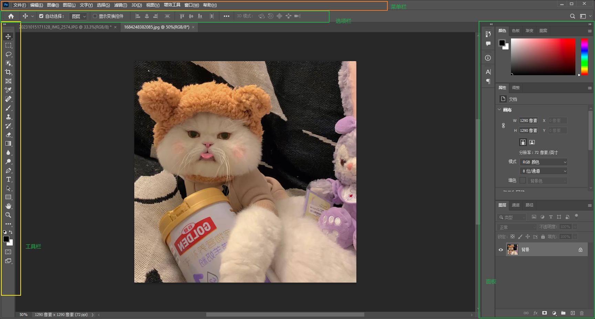
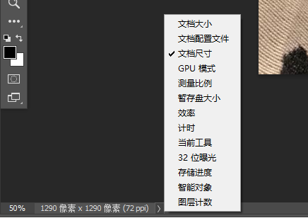
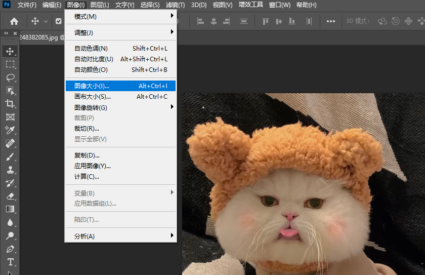
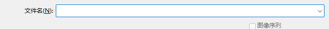
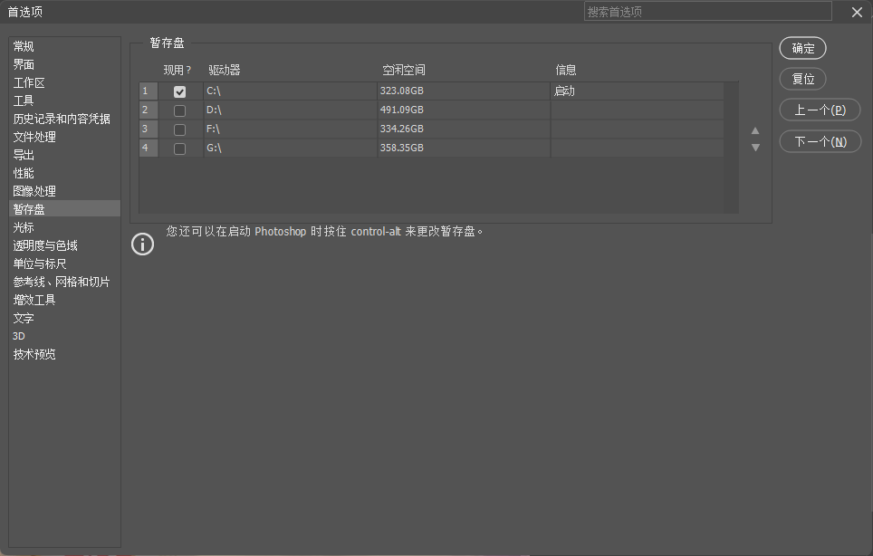
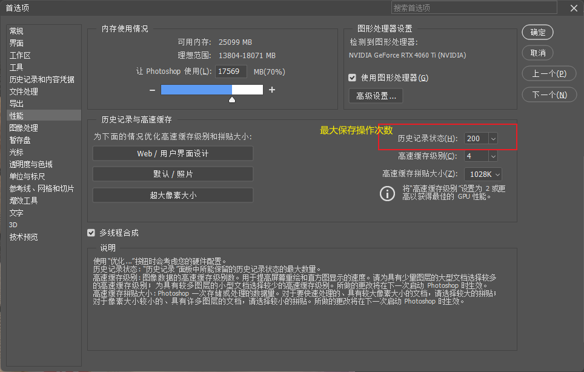
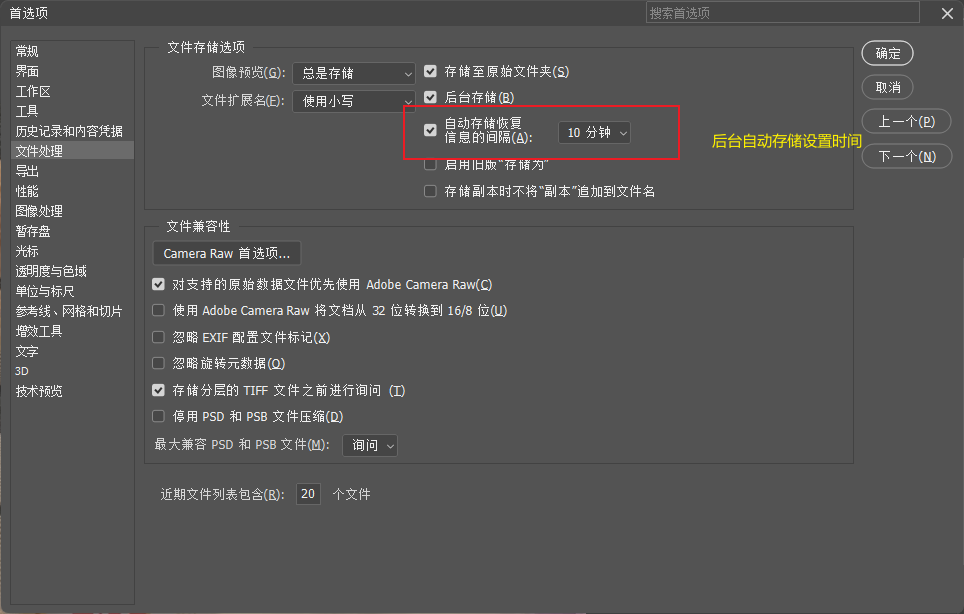
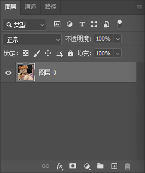

## 一、主界面构成

界面如图所示

1. 菜单栏

2. 工具栏

   在编辑-工具栏中可以自定义工具栏

3. 选项栏

   1. 是对工具参数调节的面板

4. 工作信息栏

   

   点击右侧">",可以选择显示相关工作信息

   在工作信息栏点击鼠标左键，可以显示详细信息

## 二、快捷键&小知识

1. 快捷键
   1. Ctrl+鼠标滚轮 --》画面左右移动
   2. Shift+鼠标滚轮 --》画面上下移动
   3. Alt+鼠标滚轮 --》缩放画面
   4. Ctrl+Alt+I -->调整图像大小
   5. Ctrl+O --》快速打开文件
   6. Ctrl+Alt+S --》快捷存储
   7. Ctrl+K --》快速打开首选项
   8. Ctrl+Alt+ --》快速打开快捷键设置
   9. Ctrl+Shift+N --》新建图层
   10. Ctrl+‘+’/‘-’ --》放大/缩小图像
2. 小知识
   1. 分辨率的单位简称Ppi， 72Ppi表示1英寸由72个像素点组成
   2. 常用分辨率设置：
      - 洗印照片：300+
      - 杂志、名片等：300
      - 海报高清写真：96-200
      - 网络图片、网页界面：72
      - 大型喷绘：25-50

## 三、基础学习

#### 	(一)如何修改图像大小

​			

#### （二）打开文件

​			  在打开文件时，可以选择图像序列，使用图像序列时文件名必须是有规律的

​			之后会弹出对话框设置帧速率，之后点击菜单栏-窗口-时间轴，即可快速查看多个图片

#### （三）性能配置

   1. 暂存盘

      PS在工作时会产生临时文件，内存无法临时存放，故会存放在指定硬盘中

      

   2. 历史记录

      用来保存历史操作次数，方便回退

      

   3. 自动保存

      

#### （四）图层

1. 类型：作用是通过图层的不同性质进行过滤

2. 正常部分：图层混合模式选线以及图层透明度设置

3. 锁定：有四种锁定方式

4. 图层类型：

   - 普通图层

     - 

       新建图层可以点击图层面板的“新建”

       按住Alt点击“新建”会弹出设置框

       复制图层：按住Alt拖拽图层即可

   - 背景图层

   - 智能对象图层

   - 调整图层

   - 填充图层

   - 视频图层

   - 矢量图层

   - 文字图层

#### （五）放大缩小图片

1. 按住空格键，鼠标就会变成抓手工具
2. 窗口-》导航器面板 控制图像大小
