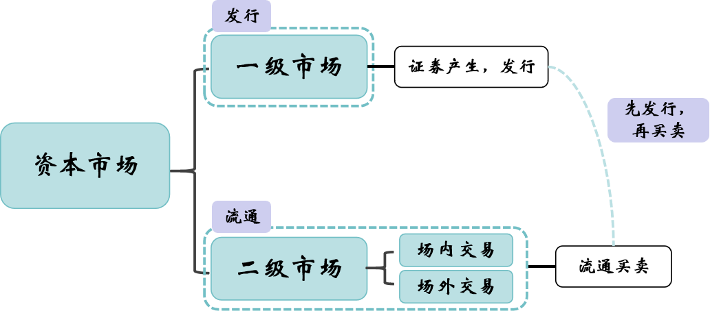
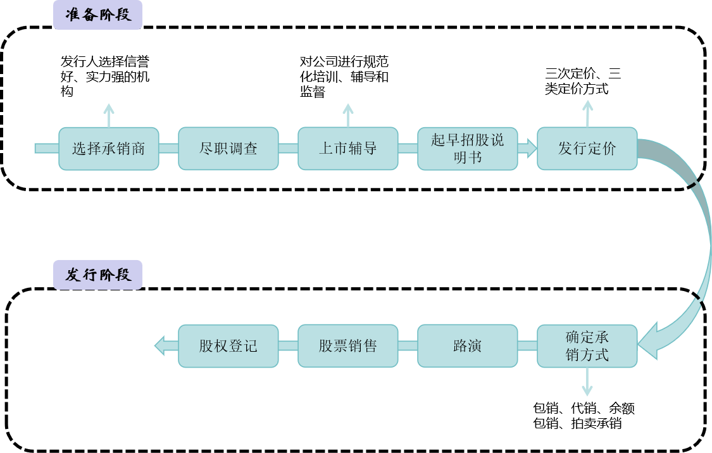

## 一、股票的概念和种类

1. **概念**

   ​        股票是投资者持有的股份公司所有权凭证，是股份公司为筹集资金而发行给股东作为持股凭证并借以取得股息和红利的一种有价证券。

2. **分类**

   1. 按照股东权利分类

      
   
   |   普通股   | 公司决策参与权、利润分配权、优先认股权、剩余资产分配权       |
   | :--------: | ------------------------------------------------------------ |
   | **优先股** | **①无决策参与权，②优先分享公司利润、分配剩余资产，③股息率固定** |

    2. 我国上市股票分类：

       1. A股（A shares）：人民币普通股票，由中国境内注册公司发行，在境内上市

          -  有涨跌幅限制（10%）

       2. B股（B shares）：人民币特种股票，以人民币标明面值，以外币认购和买卖

          - ##### 投资人
   
            - 外国的自然人、法人和其他组织
            - 中国台、港、澳地区
            - 定居海外的中国公民
            - 境内个人投资者
            - 中国证监会规定的其他投资人

          - B股是供境外投资者投资的股票

       3. H股（H shares）：即注册地在内地、上市地在香港的外资股（在纽约/新加坡上市的股票为N股/S股）

          - H股是我国过香港这个国际资本市场进行筹资的主要工具，是解决国企问题的重要于段，是推动我国企业和资本市场走向国际的重要途径，故而H股又称国企股。

   ## 二、股票发行市场和流通市场

   1. **发行市场（一级市场）**

      1. 概念：是股票发行人首次将股票出售给投资者的市场。（个人理解为上市）

      2. 股票发行
   
         

         | 发行类型 |                        首次公开发行                        |             增资发行             |
         | :------: | :--------------------------------------------------------: | :------------------------------: |
         |   定义   | 公司首次发行股票并在交易所交易 | 已发行股票的上市公司再次发行股票 |
   
         对于增资发行，主要分为配股和增发
   
         - 配股：按原股东的持股比例向其分配新股认购，目的是保护原股东的权益以及对公司的控制权
   
         - 增发：向不特定对象公开募集股份
   
           

         | 发行方式 |                             定义                             |            举例            |                             作用                             |
         | :------: | :----------------------------------------------------------: | :------------------------: | :----------------------------------------------------------: |
         | 公募发行 |             指向广泛的非特定投资者发行股票的方式             |        首次公开发行        |                    主要用于大资金量的募集                    |
         | 私募发行 |       指仅向特定投资者发行股票的一种方式，又称内部发行       |     向公司职工发行股票     | 并购方:资产证券化、巩固大股东权益、提升公司价值; 发行方: 快速融资、融投资结合、引进战略投资 |
         | 直接发行 |          指发行人不通过证券承销机构而自己发行的方式          | 私募债、金融债都是直接发行 |                              /                               |
         | 间接发行 | 指发行人不直接参与股票的发行过程，而是委托给证券承销机构承销的方式 |        首次公开发行        |                              /                               |
   
   2. **流通市场（二级市场）**
   
      1. 类型：
         1. 场内交易：指在证券交易所内进行的有组织的交易
         2. 场外交易：指在证券交易所外进行证券买卖的市场。它主要由柜台交易市场、场外股权交易市场、第三市场等组成
      
      2. 证券交易所（二级市场-场内交易）
      
         1. 概念：指经国家批准有组织、专门集中进行有价证券交易的有形场所
      
         2. 构成：经纪人、证券商。（部分公司制的交易所也是证券交易所）
      
         3. 特点：
      
            - 集中交易
      
              场内交易市场集中在证券交易所，所有的买卖双方必须在证券交易所的管理之下进行证券买卖
      
            - 公开竞价
      
              场内交易时通过**公开竞价**的方式形成的，即多个买者对多个卖者以**拍卖**的方式进行讨价还价
      
            - 经济制度
      
              在城内交易市场买卖证券活动**必须**通过专业的经纪人。因此场内交易市场是**封闭市场**
      
            - 市场监管严密
      
      3. 柜台交易市场（二级市场-场外交易）
      
         1. 概念：通过各家证券商所设的专门柜台进行证券买卖的市场，又称店头市场
      
         2. 特点：
      
            场外交易在市场组织结构、管理结构、交易方式、交易标的等诸多方面，都有自己鲜明特点。
      
            - 场外交易没有集中的交易场所。场外交易市场是由众多企业、证券公司、投资公司以及普通投资者分别交易组成的，它基本属于一个分散且无固定交易场所的无形市场
            - 场外交易是开放型交易。无论借助当面协商或者电话通讯等方式，投资者总可在某一价位上买进或者卖出所持证券。投资者既可以委托证券公司代其买进或卖出证券，也可以自行寻找交易对方，还可以与证券公司进行直接交易，完全不受证券交易大厅的地理或位置限制。
            - 场外交易的证券品种多样
            - 场外交易主要以协商定价方式成交。场内交易依照集中竞价原则确定证券交易价格，即若干卖方和若干买方通过集合竞价或连续竞价，按照时间优先和价格优先的规则，确定每项买卖的成交价格。但场外交易是按照“一对一”方式确定证券价格的，成交价格取决于交易双方协商一致。
            - 场外交易采取特殊的交易管理结构。为了确保场外交易的健康发展，证券监管机构依然以特有的方式实施着间接监管。一方面，通过划定场外交易的具体范围，避免“名为场外交易、实为场内交易”现象的出现；另一方面，支持各种自律性组织实现对场外交易的监管，鼓励证券公司和各类证券业协会对场外交易实施监管。
      
         
      
         
图1. 市场关系

   
   3. **发行以及交易流程**
   
      1. 发行流程（准备阶段+发行阶段）
   
         
   
         
   
      2. 交易流程
   
         

​				
